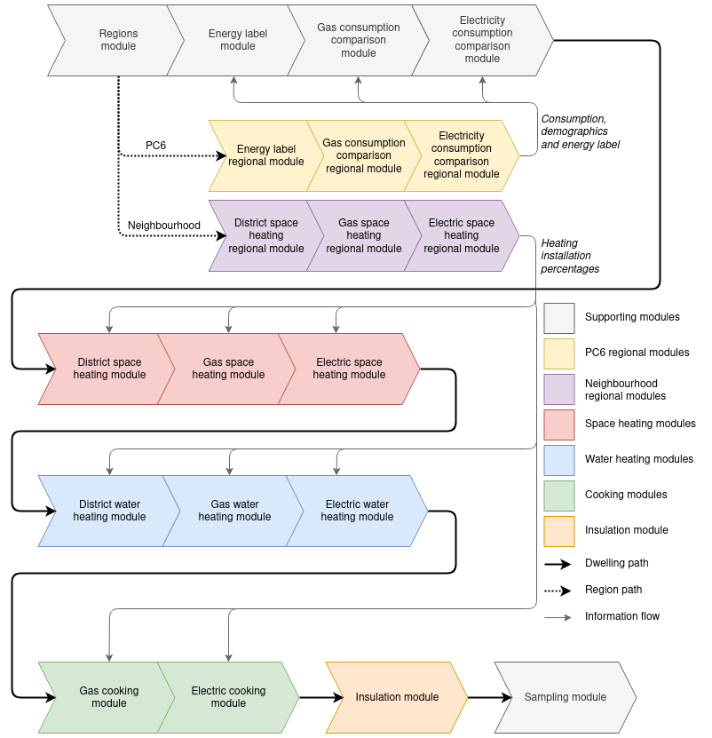
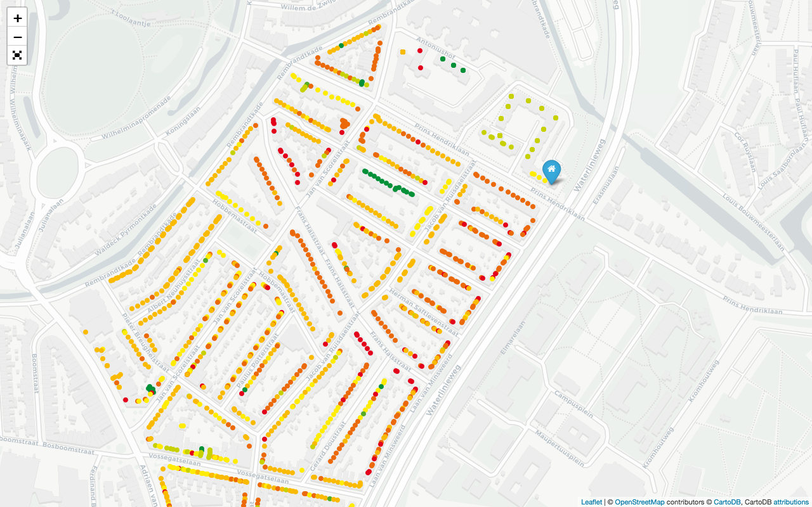

# Dutch Dwelling Database
*A database of energy characteristics of individual Dutch dwellings*

The goal of this project was to build a well-documented dataset on energy characteristics of all Dutch homes, on the level of individual dwellings.
The project was an assignment of the [Netherlands Environmental Assessment Agency](https://www.pbl.nl/), and executed by students as part of the 2021 course 'Consultancy Project' at the Utrecht University.
An explanation of the background and methodology is available in the resulting report ['Creating an energy characteristics database for individual dwellings in the Netherlands'](docs/creating_an_energy_characteristics_database-final_report.pdf).

We'd be happy for anyone to use our work, so feel free to open an issue if there any questions.

## Documentation

The pipeline uses different 'modules', that can be turned off and on (although some modules depend on the results of previous modules). The general structure of the pipeline is visualized in the following diagram:



See the report ['Creating an energy characteristics database for individual dwellings in the Netherlands'](docs/creating_an_energy_characteristics_database-final_report.pdf) for the background and methodology.

### Output structure

When all prerequisites have been met (see 'Installation'), running the pipeline will create a PostgreSQL table `results` that has the following structure:

| Column | Description |
| ------------- |-------------:|
| `vbo_id` | dwelling identification (verblijfsobject identificatie) |
| `energy_label_epi_mean` | Mean value of EPI distribution |
| `energy_label_epi_95` | 95 percentile interval of EPI |
| `energy_label_class_mean` | Energy label class |
| `energy_label_class_95` | 95 percentile interval of energy label class |
| `district_heating_space_p` | Prob. of dwelling using district heating for space heating |
| `gas_boiler_space_p` | Prob. of dwelling using a gas boiler for space heating |
| `block_heating_p` | Prob. of dwelling using block heating for space heating |
| `hybrid_heat_pump_p` | Prob. of dwelling using a hybrid heat pump for space heating |
| `electric_heat_pump_p` | Prob. of dwelling using an electric heat pump for space heating |
| `elec_boiler_space_p` | Prob. of dwelling using an electric boiler for space heating |
| `insulation_facade_r_mean` | Mean value of R-value distribution for the facade |
| `insulation_facade_r_95` | 95 percentile interval for R-values for the facade |
| `insulation_roof_r_mean` | Mean value of R-value distribution for the roof |
| `insulation_roof_r_95` | 95 percentile interval for R-values for the roof |
| `insulation_floor_r_mean` | Mean value of R-value distribution for the floor |
| `insulation_floor_r_95` | 95 percentile interval for R-values for the floor |
| `insulation_window_r_mean` | Mean value of R-value distribution for the windows |
| `insulation_window_r_95` | 95 percentile interval for R-values for the windows |
| `district_heating_water_p` | Prob. of dwelling using district heating for water heating |
| `gas_boiler_water_p` | Prob. of dwelling using a gas boiler for water heating |
| `block_heating_water_p` | Prob. of dwelling using block heating for water heating |
| `elec_boiler_water_p` | Prob. of dwelling using district heating for water heating |
| `electric_heat_pump_water_p` | Prob. of dwelling using district heating for water heating |
| `gas_cooking_p` | Prob. of dwelling using gas for cooking |
| `electric_cooking_p` | Prob. of dwelling using electricity for cooking |
| `space_heating` | Code describing space heating installation(s) present |
| `water_heating` | Code describing water heating installation(s) present |
| `cooking` | Code describing cooking installation(s) present |

## Installation

Make sure you have Python3 and [PostgreSQL](https://www.postgresql.org/download/) installed. On macOS you can use [Homebrew](https://brew.sh/):
`brew install postgresql`, or use the [PostgreSQL installer](https://www.enterprisedb.com/downloads/postgres-postgresql-downloads).

Make sure that `psql` is accessible in your terminal. If you used the installer on macOS you might need to [update your `PATH`](https://dba.stackexchange.com/a/3008) with e.g. `/Library/PostgreSQL/12/bin/`.

To check installed versions (any later versions will probably work too):

```
$ python --version
Python 3.7.5
$ psql --version
psql (PostgreSQL) 12.6
```

### Install Python dependencies

```
pip install python-dotenv psycopg2-binary requests cbsodata numpy pandas
```

For the analysis you might also need:

```
pip install scipy matplotlib scikit-learn seaborn statsmodels
```

And for mapping purposes:

```
pip install pyproj==2.5.0 folium
```

We use pyproj 2.5.0 since there is [some kind of bug](https://stackoverflow.com/questions/64713759/how-to-install-geopandas-properly#comment114426803_64713759) with more recent versions.

## Downloading and loading the datasets

**First:** fill `.env` with the required values (see `.env.template` for the structure). You can get the required EP-Online API key with [this form from the RVO](https://epbdwebservices.rvo.nl/).

### Get required datasets

We try to automatically download as many datasets as possible. Only the BAG cannot be downloaded easily, so for that you will need to manually copy the file into the `data` folder:

- BAG (custom export enriched with dwelling types): `BAG_Invoer_RuimtelijkeData_BAG_vbo_woonfunctie_studiegebied_Export.csv`

If you want to do analysis on the WoON survey, you also need to copy the WoON results to `data`, but it is not required for the pipeline:

- WoON survey: `WoON2018energie_e_1.0.csv`

### Loading
To download the rest of the data sets and load all of them, make sure that you are connected to the internet and run the setup tool:

```
python setup.py
```

The setup tool should work idempotently: running it twice has the same effect of running it once (except when there are datasets missing in the first run of course). This means you can run it as often as you like (even though that should have no effect).

### CBS datasets

To manually download extra CBS-datasets for evaluation / exploration, get their table ID (e.g. from the [CBS Open Data Portal](https://opendata.cbs.nl/portal.html), find the 'Identifier' that is usually of the form '12345NED') and then:

```
python utils/CBS_load_tables.py $tableID
```

If these datasets are required for the pipeline to run, make sure to include them in the `cbs()` function within `setup.py` so that they will be downloaded during the setup.

## Running the date pipeline

To run the data pipeline and populate the `results` table, first make sure that all required datasets have been loaded via the setup command above. Then:

```
python pipeline.py
```

This will run the pipeline on the whole BAG (~8M entries), so it can take while (up to a day or so). To process only a subset, use either the flags `--N <N>` to limit processing to N dwellings or `--vbo_id <vbo_id>` to process one specific dwelling and its neighbourhood.

Results from previous runs are saved; new runs automatically exclude dwellings that have already been processed.
To force a fresh run and delete all previous results, use the `--fresh` flag.

## Maps

You can make a map with the results for a specific dwelling and its neighbourhood:

```
python cartography/create_results_map.py { --vbo_id <vbo_id> | --address <address in 1234AB_123 format> }
```

This will generate the file `map-1234AB_123.html` in the folder `cartography`, which you can open with a browser (an internet connection is required for the map tiles to load). To generate the map, it is not required to have run the pipeline first: it will automatically process the required dwellings (but do follow the setup first).

Example for address `3583EP-50` (the [Rietveld Schröder House](https://en.wikipedia.org/wiki/Rietveld_Schr%C3%B6der_House)):



## Tests

There are some unittests to test parts of the behaviour of the modules and the utils. They do not rely on the database, so you can run these without having PostgreSQL installed or the databases loaded.

To run all tests:

```
python -m unittest [-v]
```

## License

This project is licensed under the terms of the [GNU General Public License v3.0](LICENSE).
